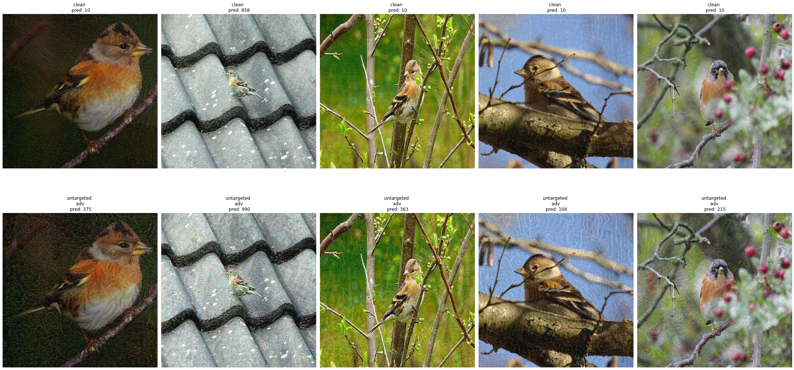
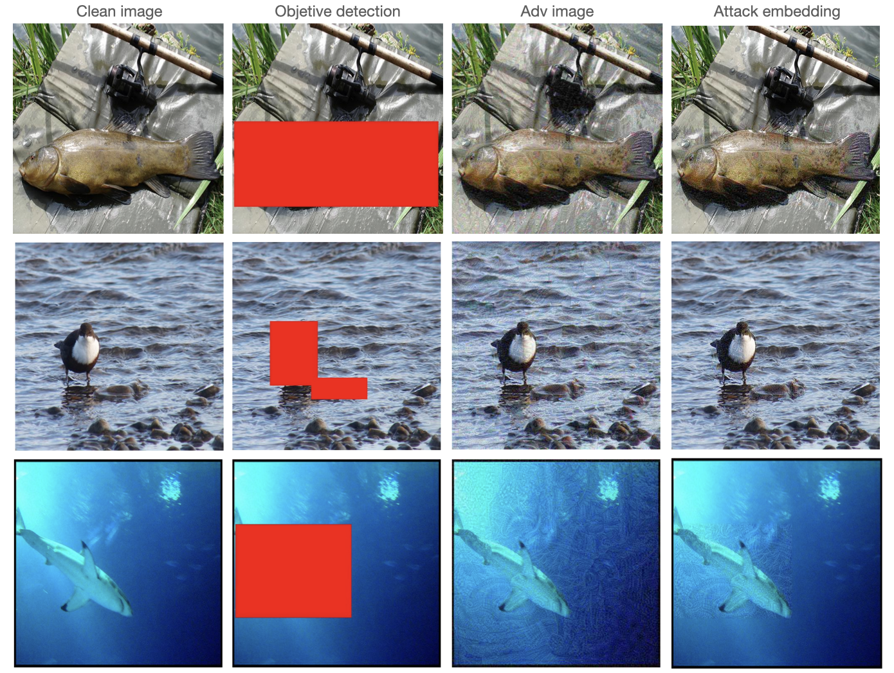

# [CVPR2021 安全AI挑战者计划第六期：ImageNet无限制对抗攻击](https://tianchi.aliyun.com/competition/entrance/531853/information)

- [排名](#排名)
- [题意](#题意)
- [方案](#方案)
  - [初赛](#初赛)
  - [复赛](#复赛)
  - [参数](#参数)
- [参考](#参考)


## 排名

初赛：82/1557	

复赛：63/1557


## 题意

对给出在 `Imagenet` 筛选的图片（1000 分类标签）进行攻击，修改图像并提交，提交的图像样本会通过一系列预先定义「攻击性、自然真实度、和原图的感知距离」指标进行机器打分。总体就是要在原图的基础上改动，不仅要保证改动最小，还要保证一定的攻击性。由于不清楚评测的分类模型，因此属于黑盒攻击（Black-box attack）。


## 方案

### 初赛

初赛采用的模型包括 Inceptionv3、VGG16、EfficientNet、ResNet 等，主要在这三开源库「  [advertorch](https://github.com/BorealisAI/advertorch)」、「[auto-attack](https://github.com/fra31/auto-attack)」、「[adversarial-attacks-pytorch](https://github.com/Harry24k/adversarial-attacks-pytorch)」进行了不同分类模型和攻击方法的组合。

最终我们采用带有对抗训练的  `('efficientnet-b6', advprop=True)` 作为分类模型的 Backbone，采用  [advertorch](https://github.com/BorealisAI/advertorch) 中的 `LinfPGDAttack`，扰动 `16/255`，迭代 40 次，扰动 `32/255`，迭代 50 次。在 `Colab Tesla V100 16G` 大概需要 14 小时，由于 Colab 的时长限制，在 63% 时断开过一次，我们等了一天再接着生成剩下的对抗样本。



这时的分数大概在 22，后面再在对抗样本上采取「添加高斯噪声、JPEG 压缩、ISR 超分辨率重建」等方法，其中只有` JPEG 压缩 `提高了大概 5 分。


### 复赛

复赛不在是初赛的评判模型，更加具有鲁棒性。我们根据初赛的方案生成了 5000 张图像，分数为 14.22，采取「添加高斯噪声、JPEG 压缩、ISR 超分辨率重建」等方法，全部降分。

后面我们仅针对目标语义区域攻击，尽量减少图像在其他地方的攻击。通过「目标检测」先检测出攻击目标（本想采用分割，但是没有找到适合 ImageNet 分割的模型，就将 BBox 改成画红色矩形覆盖），再和对抗样本合成，提取目标范围的攻击，再将其覆盖到原图上，实现尽量小的攻击范围，提升自然真实度、和原图的感知距离。但比赛刚刚结束（2021 年 4 月 1 日 15:00）😭，还不知道会不会提分。





### 参数

1. Backbone： `('efficientnet-b6', advprop=True)`

   

2. LinfPGDAttack:  `LinfPGDAttack(model, loss_fn=loss_fn, eps=32/255, nb_iter=60, eps_iter=0.01, rand_init=True, clip_min=0.0, clip_max=1.0, targeted=None)`

   

3. Object detection: `  Cascade R-CNN(class_num: 676) + ppyolo(class_num: 80)`

   采用 Paddle 开源的 PaddleDetection 进行目标检测，对其中的 `draw_bbox` 进行了改写。

   ```python
   # visualizer path: PaddleDetection/ppdet/utils/visualizer.py 
   
   def draw_bbox(image, im_id, catid2name, bboxes, threshold):
       """
       Draw bbox on image
       """
       draw = ImageDraw.Draw(image)
       
       catid2color = {}
       color_list = colormap(rgb=True)[:40]
       for dt in np.array(bboxes):
           if im_id != dt['image_id']:
               continue
           catid, bbox, score = dt['category_id'], dt['bbox'], dt['score']
           if score < threshold:
               continue
   
           xmin, ymin, w, h = bbox
           xmax = xmin + w
           ymax = ymin + h
   
           if catid not in catid2color:
               idx = np.random.randint(len(color_list))
               catid2color[catid] = color_list[idx]
           color = tuple(catid2color[catid])
   
           # draw rectangle 
           draw.rectangle([(xmin, ymin), (xmax, ymax)],fill=(255,0,0))
       return image
   ```

   

4. Attack embedding：

   ```python
   # images1： adv
   # images2： cln + mark
   # images3： cln
   
   RESULT_PREFIXX = ['images1/','images2/','images3/']
   
   def emb_per_image(image_id):
       result_list = []
       for j in range(len(RESULT_PREFIXX)):
           img_name = RESULT_PREFIXX[j]+str(image_id)+'.jpg'
           im = cv2.imread(img_name)       
           result_list.append(im)
       img1, img2, img3 = result_list[0], result_list[1], result_list[2]
   
       #Step 1: get mask
       mark = cv2.subtract(img2, img3)
       gray = cv2.cvtColor(mark, cv2.COLOR_BGR2GRAY)
       _, mask = cv2.threshold(gray, 0, 255, cv2.THRESH_BINARY |cv2.THRESH_OTSU)
   
       #Step 2: get masked
       masked = cv2.add(img1, np.zeros(np.shape(img1), dtype=np.uint8), mask=mask)
       
       #Step 3: embedding(masked, cln)
       cln_add_adv = cv2.add(img3, masked)
       for i in range(500):
           for j in range(500):
               if (masked[i,j] != 0 ).any():
                   cln_add_adv[i,j] = masked[i,j]
       
       cv2.imwrite('images/'+str(image_id)+'.jpg', cln_add_adv, [int(cv2.IMWRITE_JPEG_QUALITY), 75])
   ```


5. JPEG 压缩

   ```Python
   # PIL: 
   image.save(filepath+name_fullsize, quality=42) 
   # OpenCV: 
    cv2.imwrite('images/'+str(image_id)+'.jpg', cln_add_adv, [int(cv2.IMWRITE_JPEG_QUALITY), 42])
   ```

   

6. 高斯噪声

   ```python
   def gasuss_noise(image, mean=0, var=0.00000001):
       ''' 
           添加高斯噪声
           image:原始图像
           mean : 均值 
           var : 方差,越大，噪声越大
       '''
       image_name = image
       image = cv2.imread(image)
   
       image = np.array(image/255, dtype=float)#将原始图像的像素值进行归一化，除以255使得像素值在0-1之间
       noise = np.random.normal(mean, var ** 0.5, image.shape)#创建一个均值为mean，方差为var呈高斯分布的图像矩阵
       out = image + noise#将噪声和原始图像进行相加得到加噪后的图像
       if out.min() < 0:
           low_clip = -1.
       else:
           low_clip = 0.
       out = np.clip(out, low_clip, 1.0)#clip函数将元素的大小限制在了low_clip和1之间了，小于的用low_clip代替，大于1的用1代替
       out = np.uint8(out*255)#解除归一化，乘以255将加噪后的图像的像素值恢复
       #cv.imshow("gasuss", out)
       noise = noise*255
   
       #cv2.imwrite(image_name.replace('images', 'newimages'), out)
       return out
   ```

   

7. CutMix

   官方 Tips 中的禁用方法，复赛试了一下，大概 9 分左右。
   
   

8. ISR

   主要通过降低图片分辨率，然后在重建。

   

9. 多模融合

   ```python
   class Ensemble(nn.Module):
       def __init__(self, model1, model2): #):
           super(Ensemble, self).__init__()
           self.model1 = model1
           self.model2 = model2
           #self.model3 = model3
   
       def forward(self, x):
           logits1 = self.model1(x)
           logits2 = self.model2(x)
           #logits3 = self.model3(x)
   
           # fuse logits
           logits_e = (logits1 + logits2 ) / 2 #+ logits3) / 3
   
           return logits_e
   ```

   


## 参考

1. advertorch

- https://github.com/BorealisAI/advertorch

- https://advertorch.readthedocs.io/

  

2. auto-attack

- https://github.com/fra31/auto-attack

  

3. adversarial-attacks-pytorch

- https://github.com/Harry24k/adversarial-attacks-pytorch

```python
#Least Likely
atk = torchattacks.PGD(model, eps=8/255, alpha=2/255, steps=100) #扰动8个像素点
atk.set_mode_least_likely()
```


4. CutMix 

- https://github.com/clovaai/CutMix-PyTorch

+ https://github.com/ildoonet/cutmix

  

5. ISR

- https://github.com/idealo/image-super-resolution


6. PaddleDetection

- https://github.com/PaddlePaddle/PaddleDetection

