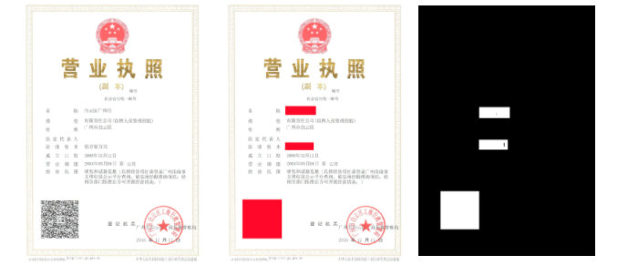
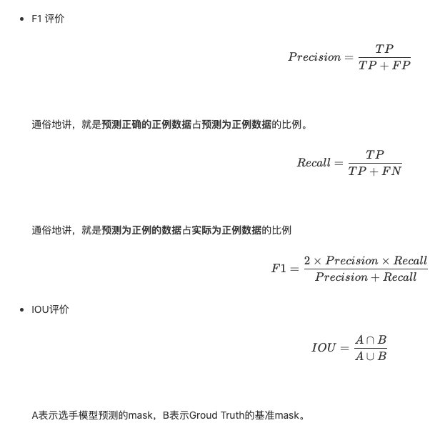

[TOC]

# 0 队伍简介

**队伍名称：** 猛狗哭泣

**公榜 A 排名：** 31/1470

**私榜 A 排名:   ** 33/1470


# 1 比赛简介

比赛本质上就是图像分割。

> **大赛名称：**安全AI挑战者计划第五期：伪造图像的篡改检测-赛道2
>
> **官方简介：** https://tianchi.aliyun.com/competition/entrance/531812/introduction  赛道2（10月12日10:00AM (UTC+8)开启，赛道1报名选手无需重复报名）伪造图像的对抗攻击比赛的赛道1——攻击比赛已经接近尾声，很多高质量的P图不但骗过人眼，还成功骗过我们提供的4个经典检测模型，那是否就真的是“魔高一丈”（反取证技术）呢？我们的对抗攻击比赛开始进入赛道2——检测比赛将在10月12日10:00AM (UTC+8)拉开帷幕！设计出“火眼金睛”（检测算法），把别人的“挖坑”（篡改区域）一一识别出来。区别于以往的图像取证比赛专注于自然内容图像，我们比赛采用的数据为大量伪造的证书文档类图像。任务是通过提供的训练集学习出有效的检测算法，对测试集的伪造图像进行篡改定位。为了更好的评价选手的检测定位效果，我们设计了全面的得分计算准则。


## A 数据形式

- 数据包括训练集和测试集，训练集有1500张JPEG图像及对应mask（分辨率与原图保持一致，像素值0表示该像素标识为未篡改，像素值1表示该像素标识为篡改），JPEG图像的EXIF信息均被擦除，除部分无后处理外，其它可能经过裁边、平滑、下采样、社交工具传输（没有使用组合方式）；测试集有1500张JPEG图像，处理过程与训练集一致；允许使用集外数据进行训练学习。
- 参赛者提交数据时，利用我们提供的python程序生成mask，对1500张mask图像打包上传。
- 篡改图像可能包括如splicing、copy-move、object removal等任意操作，部分进行后处理（JPEG压缩、重采样、裁剪边缘等）。
- 不需要考虑图像的元数据（已经被擦除）。

- **示例**
  


## B 评估标准




# 3 解决方案

## A 运行环境

整个实验在 `Google Colab` 下完成，应主办方提交要求改写了 `.py` 方式，并通过了本地测试。

### 主要依赖库

- tensorflow ==2.1.0
- keras == 2.3.0
- segmentation-models==1.0.1


### NoteBook

- Colab Pro
  - GPU   Tesla v100 16G
  - RAM   25G

### .py

1. 安装依赖库

   `pip3 install -r requirements.txt `

2. 训练

   `$ cd code`
   `$ ./trian.sh`

3. 测试

   `$ cd code`
   `$ ./run.sh`

   

## B 数据处理

- 将图像数据准换为 np 形式的正方形矩阵，其中

  - **trian**             resize(512, 512, 3)

  - **train_mask** resize(512, 512, 1)

  - **test**               resize(512, 512, 3)

    

图像的平均长宽在 1200 左右，一开始 resize 到 `1024*1024*3`，直接爆内存（25 GiB）， `512*512*3` 的尺寸在 Colab 上基本上达到了训练极限，尽管 `256*256` 占用小了很多，但是训练模型的效果不好，最终还是将训练集 resize 为 `512*512*3`。


## C 图像增强

- horizontal_flip
- vertical_flip

```python
# Data Generator and augmentation
data_gen_args = dict(horizontal_flip=True,vertical_flip=True)
image_datagen = ImageDataGenerator(**data_gen_args)
mask_datagen = ImageDataGenerator(**data_gen_args)
```


## D Metric

```python
# Dice_Coeff or F1 score
def metric(y_true, y_pred):
    y_true_f = K.flatten(y_true)
    y_pred_f = K.flatten(y_pred)
    intersection = K.sum(y_true_f * y_pred_f)
    return (2. * intersection + 1) / (K.sum(y_true_f) + K.sum(y_pred_f) + 1)
```


## E 模型训练

使用公开的分割模型 Repo: https://github.com/qubvel/segmentation_models

Segmentation model = UNet

Backbone = efficientnetb3

|      |
| ---- |
|      |
